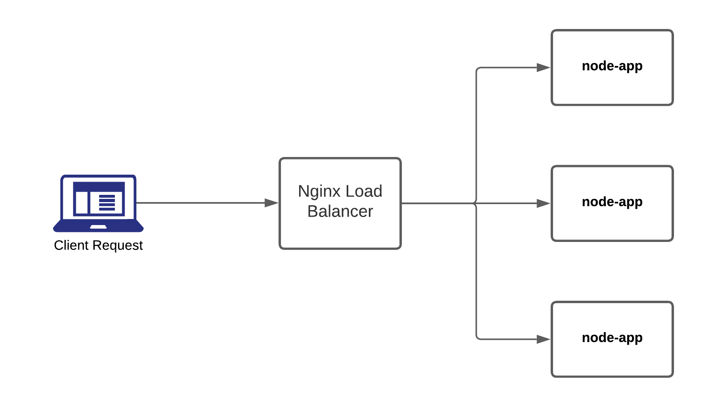
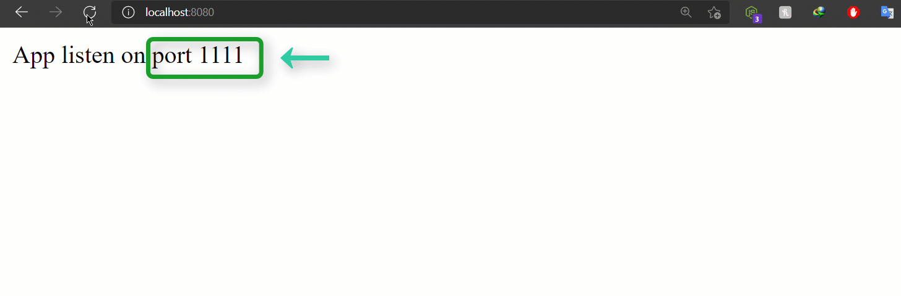

<!-- @format -->

# node microservice with nginx loadbalancer

In this documentation, I will cover

1.  What is loadbalancer?
2.  How I Configured Nginx File.
3.  What I did here.
    - what type of helped us docker-compose file.
    - what is the docker compose file.
    - Nginx Load Balancer in a container.
    - Node-App in a container.
    - let's discuss what I did here.
4.  Runnng nginx loadbalancer.

# What is loadbalancer

A load balancer can be deployed as software or hardware to a device that distributes connections from clients between a set of servers.

# How I Configured Nginx File

Here is My Nginx Configuration file `default.conf` and we understand of each line

```
user nginx;
worker_processes 1;

error_log /var/log/nginx/error.log warn;
pid       /var/run/nginx.pid;

events {
    worker_connections  1024;
}

http {
    upstream backend{
        server app1:1111;
        server app2:2222;
        server app3:3333;
    }

    server {
        location / {
            proxy_pass http://backend;
        }
    }
}
```

### Why we define user in nginx configure ?

`user nginx;`

- It is recommended to have a specific non-privileged user for your web server or any other service that can be accessed from outside your server (database, ftp, mail...), for example if there is a security flaw in your web server or web application, you don't want its processes to be run as root... Imagine if an attacker succeed to upload some php files in your server, then he could do anything he wants... Whereas with a specific user, he could do only what this specific user can do.

### What is the worker_processes and worker_connections ?

`worker_processes 1;`

- Worker processes

  - Nginx worker process that handles the incoming request.
  - Set this to `worker_process auto;` to automatically adjust the number of Nginx worker processes based on available cores.
  - This can go beyond the available cores if you have [IO](https://www.tutorialspoint.com/operating_system/os_io_hardware.htm) access.

` worker_connections 1024;`

- worker_connections is the number of simultaneous connections; so they are simply stating how to calculate, for example:

  - you are only running 1 process with 512 connections, you will only be able to serve 512 clients.
  - If 2 processes with 512 connections each, you will be able to handle 2x512=1024 clients.

`upstream`

- It's commonly used for defining either a web server cluster for load balancing, or an app server cluster for routing / load balancing.

# What I did here.

So, let's see how the backend of load balancing works

<a href="https://github.com/hamzazahidulislam/nginx-load/blob/main/nginx-load-balancer-work.png"></a>

- ### What type of helped us docker-compose file.

  - let's see the `docker-compose.yml` file

         version: '3'
         services:
         nginx_load_balancer:
             image: nginx
             volumes:
             - './nginx/default.conf:/etc/nginx/nginx.conf'
             ports:
             - '8080:80'
         app1:
             image: node-app
             environment:
             - APP_ID=1111
         app2:
             image: node-app
             environment:
             - APP_ID=2222
         app3:
             image: node-app
             environment:
             - APP_ID=3333

### what is the docker compose file.

Docker Compose is a tool that was developed to help define and share multi-container applications. With Compose, we can create a YAML file to define the services and with a single command, can spin everything up or tear it all down.

### Nginx Load Balancer in a container.

first, I define the version number. and added services and under the service, I added container `nginx_load_balancer` next line i mention the image of Nginx and set volume of the Nginx to configure file after I added port number and this is the load balancer you saw on the image

### Node-App in a container.

what are the happen here. basically I run Node JS application. what are the inside in Node JS application . i pass port environment variable on each node-app. after when some body request in api i response back of each environment varibale for undustanding of load balanacer

### let's discuss what I did here.

finally, I run three node-app and one Nginx container as a load balancer and how traffic flow inside of node-app you clearly understand when you saw the image

# Runnng nginx loadbalancer

1. `git clone https://github.com/hamzazahidulislam/nginx-load`
2. go to project folder.
3. Create node app image `docker build -t node-app .`

Expected Output:

```
[+] Building 41.4s (11/11) FINISHED
 => [internal] load build definition from Dockerfile                                                               0.0s
 => => transferring dockerfile: 32B                                                                                0.0s
 => [internal] load .dockerignore                                                                                  0.0s
 => => transferring context: 2B                                                                                    0.0s
 => [internal] load metadata for docker.io/library/node:17-alpine3.14                                              8.6s
 => [auth] library/node:pull token for registry-1.docker.io                                                        0.0s
 => [internal] load build context                                                                                  0.0s
 => => transferring context: 100B                                                                                  0.0s
 => [1/5] FROM docker.io/library/node:17-alpine3.14@sha256:281e1e120c91e109b8c8d804af5872dad3edc871e7fa3bed912ad  28.1s
 => => resolve docker.io/library/node:17-alpine3.14@sha256:281e1e120c91e109b8c8d804af5872dad3edc871e7fa3bed912ad0  0.0s
 => => sha256:281e1e120c91e109b8c8d804af5872dad3edc871e7fa3bed912ad07cb9f94709 1.43kB / 1.43kB                     0.0s
 => => sha256:5fd425bf79344733d3556716707cc8abcab8d33d3393aeea3f25951c50106842 1.16kB / 1.16kB                     0.0s
 => => sha256:a3bb90f69d892e169e7d23fac439e4ca1a04b85d6ea31c804e01b492646ca73f 6.53kB / 6.53kB                     0.0s
 => => sha256:bb76273d3646154ef6cf01ad8c3777841d373dbafdad285c686868c16e9bf2af 46.07MB / 46.07MB                  24.2s
 => => sha256:e5f12052d44993c1e3b5d7fa5b98f8adc52468cc8e1ffcc61ffd32ac79d7e837 2.35MB / 2.35MB                     7.3s
 => => sha256:3e673b3414365d85b87504d44a6b844c3776fbfafe6ab265010b65cc86badbdd 450B / 450B                         1.7s
 => => extracting sha256:bb76273d3646154ef6cf01ad8c3777841d373dbafdad285c686868c16e9bf2af                          2.9s
 => => extracting sha256:e5f12052d44993c1e3b5d7fa5b98f8adc52468cc8e1ffcc61ffd32ac79d7e837                          0.1s
 => => extracting sha256:3e673b3414365d85b87504d44a6b844c3776fbfafe6ab265010b65cc86badbdd                          0.0s
 => [2/5] WORKDIR /app                                                                                             0.4s
 => [3/5] COPY package*.json .                                                                                     0.1s
 => [4/5] RUN npm install --production                                                                             3.8s
 => [5/5] COPY index.js /app                                                                                       0.1s
 => exporting to image                                                                                             0.2s
 => => exporting layers                                                                                            0.2s
 => => writing image sha256:7e5e6009270af775d967d907e5822e392bfa9aff87e7978553a58da36511ff04                       0.0s
 => => naming to docker.io/library/node-app
```

4. Run `docker-compose up -d` command

```
[+] Running 5/5
 - Network nginx-load_default                  Created                                                             0.9s
 - Container nginx-load_app2_1                 Started                                                             3.2s
 - Container nginx-load_nginx_load_balancer_1  Started                                                             3.6s
 - Container nginx-load_app1_1                 Started                                                             3.4s
 - Container nginx-load_app3_1                 Started
```

5. Open `http://localhost:8080/` in your browser.
After open Browser, you will see the following Result.
<center>
<a href="https://github.com/hamzazahidulislam/nginx-load/blob/main/result.gif"></a><br />
</center>

## Refernces

- Nginx user
  - https://stackoverflow.com/questions/40276951/meaning-of-nginx-user-directive
- worker_processes and worker_connections
  - https://stackoverflow.com/questions/23386986/what-is-worker-processes-and-worker-connections-in-nginx
- Docker Compose
  - https://docs.docker.com/get-started/08_using_compose/
